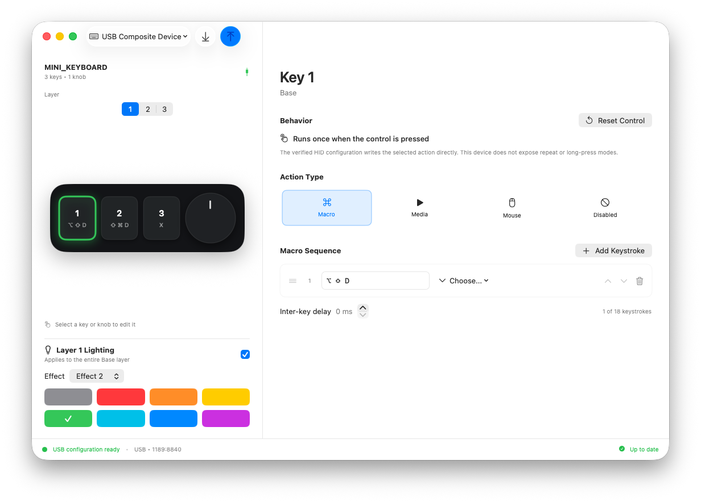

# MacroPad Studio

MacroPad Studio is a native SwiftUI macOS configuration app for inexpensive
USB macro keypads sold as `MINI_KEYBOARD`. It provides a focused editor,
device configuration reading, and an explicit review step before every
hardware write.



> [!WARNING]
> MacroPad Studio writes configuration reports to USB HID hardware. Device
> variants can share a product name while using different protocols. Only use
> write support with an exact, verified device profile.

## Status

MacroPad Studio is pre-release software. The following hardware has been
physically validated:

| USB VID:PID | Layout | Read | Write | Notes |
| --- | --- | --- | --- | --- |
| `1189:8840` | 3 keys, 1 knob, 3 layers | Yes | Yes | Report ID 3; 65-byte vendor reports |

Other profiles in the source describe known device families but remain
experimental until tested on matching physical hardware.

## Features

- Native macOS interface built with SwiftUI and SF Symbols.
- Three-key, one-knob editor with three configuration layers.
- Keyboard sequences, media controls, mouse actions, and layer lighting.
- Full configuration reading for the validated `1189:8840` device.
- Reviewable change list before any hardware write.
- Local JSON drafts stored in Application Support.
- Interactive demo mode when no supported USB device is connected.
- No analytics, update checker, or network code.

## Requirements

- macOS 14 or later
- Xcode 26 or later
- [XcodeGen](https://github.com/yonaskolb/XcodeGen) 2.45 or later

Install XcodeGen with Homebrew:

```sh
brew install xcodegen
```

## Build

`project.yml` is the source of truth for the generated Xcode project.

```sh
./Scripts/build.sh
./Scripts/test.sh
```

To open the project in Xcode:

```sh
xcodegen generate
open MacroPadStudio.xcodeproj
```

## Run and connect

1. Connect the keypad directly over USB.
2. Launch MacroPad Studio.
3. Confirm that the detected VID:PID and physical layout match the device.
4. Read the existing configuration or edit a local draft.
5. Review every pending change before applying it to the keypad.

Bluetooth discovery is read-only. Configuration reading and writing require
the validated USB configuration interface. On the observed BLE
`MINI_KEYBOARD`, macOS exposes only the standard keyboard/mouse/consumer HID
endpoint (`1452:022C`, max output report size 2), not the 65-byte vendor
configuration reports used over USB.

## Safety model

- Hardware writes require a user-facing review and confirmation.
- Configuration reading is enabled only for the physically verified
  `1189:8840` profile.
- The read protocol returns control assignments, not verified lighting data;
  local layer names and lighting are preserved.
- Firmware update, bootloader, and undocumented read reports are intentionally
  unsupported.
- HID encoding is kept pure and covered by byte-level tests.
- The verified HID format does not expose repeat or long-press settings;
  actions run once when their physical control is pressed.
- Hardware integration tests are disabled unless a one-use local token is
  created deliberately. See [Hardware testing](docs/HARDWARE_TESTING.md).

## Package a local build

```sh
./Scripts/package.sh
```

This creates an ad-hoc-signed archive at
`outputs/MacroPad-Studio-macOS.zip` plus a SHA-256 checksum. Version `0.1.0`
is distributed as an explicitly marked, non-notarized pre-release build and
may be blocked by Gatekeeper. A normal public release requires a Developer ID
signature and Apple notarization; see [Releasing](docs/RELEASING.md).

## Project structure

| Path | Purpose |
| --- | --- |
| `MacroPadStudio/Models` | Device profiles and editable configuration |
| `MacroPadStudio/Protocol` | Pure HID encoding and configuration decoding |
| `MacroPadStudio/Services` | IOKit device access and local persistence |
| `MacroPadStudio/ViewModels` | Editor state and guarded apply workflow |
| `MacroPadStudio/Views` | Native macOS interface |
| `MacroPadStudioTests` | Protocol, persistence, UI, and gated hardware tests |
| `Design` | Selected visual reference used for UI QA |

## Contributing

Read [CONTRIBUTING.md](CONTRIBUTING.md) before proposing a change. Device
support contributions need exact USB identifiers, a physical layout, captured
evidence, and read-only investigation before writes are considered.

Security issues involving unsafe reports or unintended hardware writes should
follow [SECURITY.md](SECURITY.md), not a public issue.

## License and provenance

MacroPad Studio is licensed under the MIT License. See
[LICENSE](LICENSE), [COPYRIGHT.md](COPYRIGHT.md), and
[THIRD_PARTY_NOTICES.md](THIRD_PARTY_NOTICES.md).

Protocol behavior was independently reimplemented with reference to the
GPL-3.0 project [rOzzy1987/MacroPad](https://github.com/rOzzy1987/MacroPad)
and observations from the vendor `MINI_KEYBOARD` application. MacroPad Studio
is not affiliated with or endorsed by the keypad manufacturer or seller.
